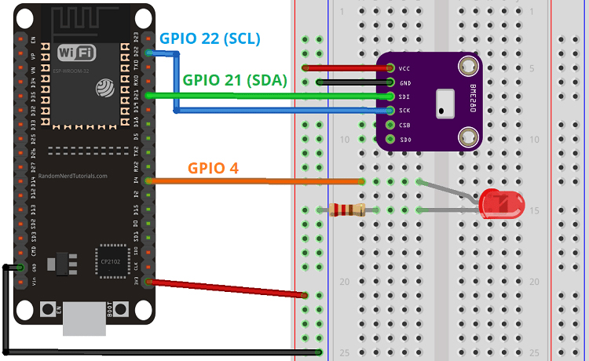
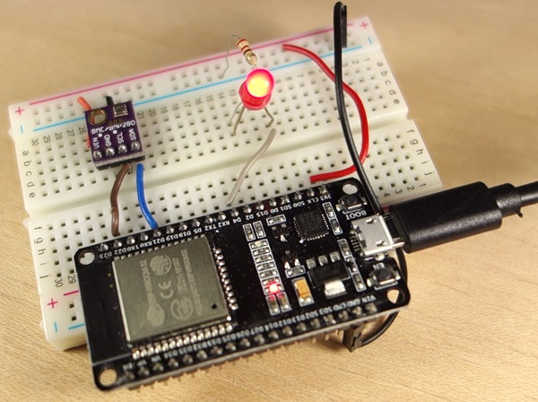

# ESP32 MQTT – Publish and Subscribe with Arduino IDE
This project shows how to use MQTT communication protocol with the ESP32 to publish messages and subscribe to topics. As an example, we’ll publish BME280 sensor readings to the Node-RED Dashboard, and control an ESP32 output. The ESP32 we’ll be programmed using Arduino IDE.

# Project Overview
In this example, there’s a Node-RED application that controls ESP32 outputs and receives sensor readings from the ESP32 using MQTT communication protocol. The Node-RED application is running on a Raspberry Pi.

We’ll use the Mosquitto broker installed on the same Raspberry Pi. The broker is responsible for receiving all messages, filtering the messages, decide who is interested in them and publishing the messages to all subscribed clients.

The following figure shows an overview of what we’re going to do in this tutorial.

The Node-RED application publishes messages (“on” or “off“) in the topic esp32/output. The ESP32 is subscribed to that topic. So, it receives the message with “on” or “off” to turn the LED on or off.
The ESP32 publishes temperature on the esp32/temperature topic and the humidity on the esp32/humidity topic. The Node-RED application is subscribed to those topics. So, it receives temperature and humidity readings that can be displayed on a chart or gauge, for example.
Note: there’s also a similar tutorial on how to use the ESP8266 and Node-RED with MQTT.

# Prerequisites
You should be familiar with the Raspberry Pi – read Getting Started with Raspberry Pi.
You should have the Raspbian operating system installed in your Raspberry Pi – read Installing Raspbian Lite, Enabling and Connecting with SSH.
You need Node-RED installed on your Pi and Node-RED Dashboard.
Learn what’s MQTT and how it works.
# Parts Required
These are the parts required to build the circuit (click the links below to find the best price at Maker Advisor):

-Raspberry Pi – read Best Raspberry Pi 3 Starter Kits

-ESP32 DOIT DEVKIT V1 Board – read ESP32 Development Boards Review and Comparison

-BME280 sensor module

-1x 5mm LED

-1x 220 Ohm resistor

-Breadboard

-Jumper wires

# Introducing the BME280 Sensor Module
The BME280 sensor module reads temperature, humidity, and pressure. Because pressure changes with altitude, you can also estimate altitude. However, in this tutorial we’ll just read temperature and humidity. There are several versions of this sensor module, but we’re using the one shown in the figure below.

The sensor can communicate using either SPI or I2C communication protocols (there are modules of this sensor that just communicate with I2C, these just come with four pins).
To use SPI communication protocol, use the following pins:

SCK – this is the SPI Clock pin

SDO – MISO

SDI – MOSI

CS – Chip Select

To use I2C communication protocol, the sensor uses the following pins:

SCK – SCL pin

SDI – SDA pin

# Schematic
We’re going to use I2C communication with the BME280 sensor module. For that, wire the sensor to the ESP32 SDA and SCL pins, as shown in the following schematic diagram.

We’ll also control an ESP32 output, an LED connected to GPIO 4.


Here’s how your circuit should look:


# Preparing the Arduino IDE
There’s an add-on for the Arduino IDE that allows you to program the ESP32 using the Arduino IDE and its programming language. Follow one of the next tutorials to prepare your Arduino IDE to work with the ESP32, if you haven’t already.

Windows instructions – ESP32 Board in Arduino IDE
Mac and Linux instructions – ESP32 Board in Arduino IDE
After making sure you have the ESP32 add-on installed, you can continue with this tutorial.

# Installing the PubSubClient Library
The PubSubClient library provides a client for doing simple publish/subscribe messaging with a server that supports MQTT (basically allows your ESP32 to talk with Node-RED).

Click here to download the PubSubClient library. You should have a .zip folder in your Downloads folder
Unzip the .zip folder and you should get pubsubclient-master folder
Rename your folder from pubsubclient-master to pubsubclient
Move the pubsubclient folder to your Arduino IDE installation libraries folder
Then, re-open your Arduino IDE
The library comes with a number of example sketches. See File >Examples > PubSubClient within the Arduino IDE software.
Important: PubSubClient is not fully compatible with the ESP32, but the example provided in this tutorial is working very reliably during our tests.

# Installing the BME280 library
To take readings from the BME280 sensor module we’ll use the Adafruit_BME280 library. Follow the next steps to install the library in your Arduino IDE:

Click here to download the Adafruit-BME280 library. You should have a .zip folder in your Downloads folder
Unzip the .zip folder and you should get Adafruit-BME280-Library-master folder
Rename your folder from Adafruit-BME280-Library-master to Adafruit_BME280_Library
Move the Adafruit_BMPE280_Library folder to your Arduino IDE installation libraries folder
Finally, re-open your Arduino IDE
Alternatively, you can go to Sketch > Include Library > Manage Libraries and type “adafruit bme280” to search for the library. Then, click install.

# Installing the Adafruit_Sensor library
To use the BME280 library, you also need to install the Adafruit_Sensor library. Follow the next steps to install the library:

Click here to download the Adafruit_Sensor library. You should have a .zip folder in your Downloads folder
Unzip the .zip folder and you should get Adafruit_Sensor-master folder
Rename your folder from Adafruit_Sensor-master to Adafruit_Sensor
Move the Adafruit_Sensor folder to your Arduino IDE installation libraries folder
Finally, re-open your Arduino IDE
Uploading code
Now, you can upload the following code to your ESP32. The code is commented on where you need to make changes. You need to edit the code with your own SSID, password and Raspberry Pi IP address.
# Uploading code
Now, you can upload the following code to your ESP32. The code is commented on where you need to make changes. You need to edit the code with your own SSID, password and Raspberry Pi IP address.

```
*********/
 
#include <WiFi.h>
#include <PubSubClient.h>
#include <Wire.h>
#include <Adafruit_BME280.h>
#include <Adafruit_Sensor.h>
 
// Replace the next variables with your SSID/Password combination
const char* ssid = "REPLACE_WITH_YOUR_SSID";
const char* password = "REPLACE_WITH_YOUR_PASSWORD";
 
// Add your MQTT Broker IP address, example:
//const char* mqtt_server = "192.168.1.144";
const char* mqtt_server = "YOUR_MQTT_BROKER_IP_ADDRESS";
 
WiFiClient espClient;
PubSubClient client(espClient);
long lastMsg = 0;
char msg[50];
int value = 0;
 
//uncomment the following lines if you're using SPI
/*#include <SPI.h>
#define BME_SCK 18
#define BME_MISO 19
#define BME_MOSI 23
#define BME_CS 5*/
 
Adafruit_BME280 bme; // I2C
//Adafruit_BME280 bme(BME_CS); // hardware SPI
//Adafruit_BME280 bme(BME_CS, BME_MOSI, BME_MISO, BME_SCK); // software SPI
float temperature = 0;
float humidity = 0;
 
// LED Pin
const int ledPin = 4;
 
void setup() {
  Serial.begin(115200);
  // default settings
  // (you can also pass in a Wire library object like &Wire2)
  //status = bme.begin();  
  if (!bme.begin(0x76)) {
    Serial.println("Could not find a valid BME280 sensor, check wiring!");
    while (1);
  }
  setup_wifi();
  client.setServer(mqtt_server, 1883);
  client.setCallback(callback);
 
  pinMode(ledPin, OUTPUT);
}
 
void setup_wifi() {
  delay(10);
  // We start by connecting to a WiFi network
  Serial.println();
  Serial.print("Connecting to ");
  Serial.println(ssid);
 
  WiFi.begin(ssid, password);
 
  while (WiFi.status() != WL_CONNECTED) {
    delay(500);
    Serial.print(".");
  }
 
  Serial.println("");
  Serial.println("WiFi connected");
  Serial.println("IP address: ");
  Serial.println(WiFi.localIP());
}
 
void callback(char* topic, byte* message, unsigned int length) {
  Serial.print("Message arrived on topic: ");
  Serial.print(topic);
  Serial.print(". Message: ");
  String messageTemp;
   
  for (int i = 0; i < length; i++) {
    Serial.print((char)message[i]);
    messageTemp += (char)message[i];
  }
  Serial.println();
 
  // Feel free to add more if statements to control more GPIOs with MQTT
 
  // If a message is received on the topic esp32/output, you check if the message is either "on" or "off". 
  // Changes the output state according to the message
  if (String(topic) == "esp32/output") {
    Serial.print("Changing output to ");
    if(messageTemp == "on"){
      Serial.println("on");
      digitalWrite(ledPin, HIGH);
    }
    else if(messageTemp == "off"){
      Serial.println("off");
      digitalWrite(ledPin, LOW);
    }
  }
}
 
void reconnect() {
  // Loop until we're reconnected
  while (!client.connected()) {
    Serial.print("Attempting MQTT connection...");
    // Attempt to connect
    if (client.connect("ESP8266Client")) {
      Serial.println("connected");
      // Subscribe
      client.subscribe("esp32/output");
    } else {
      Serial.print("failed, rc=");
      Serial.print(client.state());
      Serial.println(" try again in 5 seconds");
      // Wait 5 seconds before retrying
      delay(5000);
    }
  }
}
void loop() {
  if (!client.connected()) {
    reconnect();
  }
  client.loop();
 
  long now = millis();
  if (now - lastMsg > 5000) {
    lastMsg = now;
     
    // Temperature in Celsius
    temperature = bme.readTemperature();   
    // Uncomment the next line to set temperature in Fahrenheit 
    // (and comment the previous temperature line)
    //temperature = 1.8 * bme.readTemperature() + 32; // Temperature in Fahrenheit
     
    // Convert the value to a char array
    char tempString[8];
    dtostrf(temperature, 1, 2, tempString);
    Serial.print("Temperature: ");
    Serial.println(tempString);
    client.publish("esp32/temperature", tempString);
 
    humidity = bme.readHumidity();
     
    // Convert the value to a char array
    char humString[8];
    dtostrf(humidity, 1, 2, humString);
    Serial.print("Humidity: ");
    Serial.println(humString);
    client.publish("esp32/humidity", humString);
  }
}
```
This code publishes temperature and humidity readings on the esp32/temperature and esp32/humidity topics trough MQTT protocol.

The ESP32 is subscribed to the esp32/output topic to receive the messages published on that topic by the Node-RED application. Then, accordingly to the received message, it turns the LED on or off.

# Subscribing to MQTT topics
In the reconnect() function, you can subscribe to MQTT topics. In this case, the ESP32 is only subscribed to the esp32/output:
