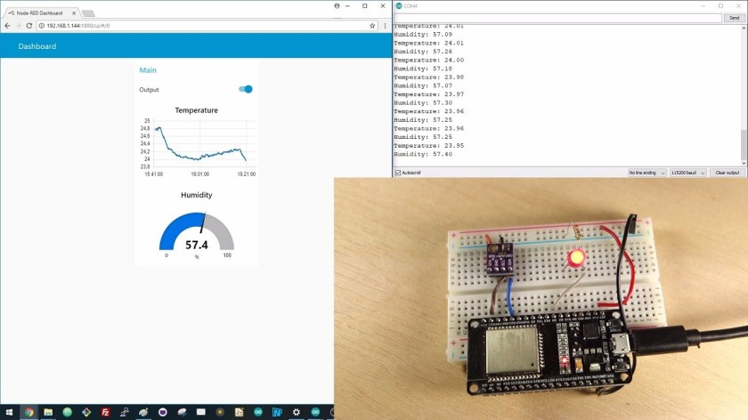
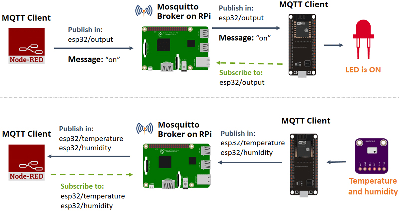
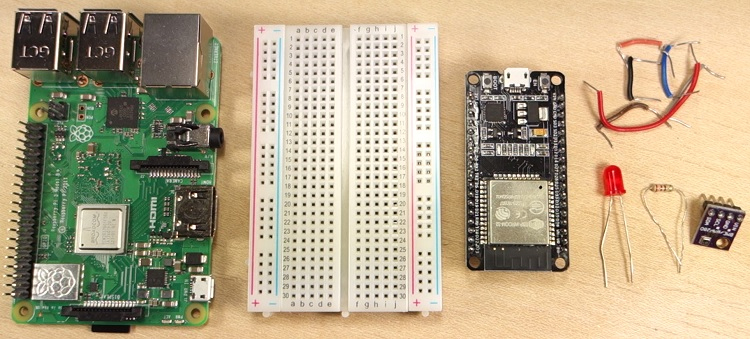
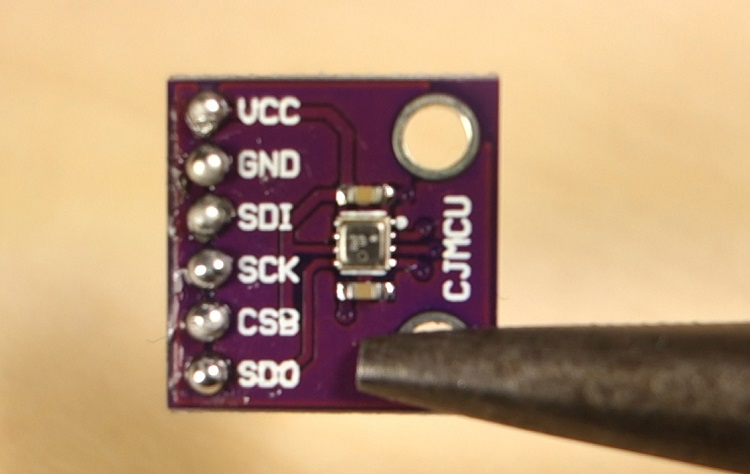

# ESP32 MQTT – Publish and Subscribe with Arduino IDE
This project shows how to use MQTT communication protocol with the ESP32 to publish messages and subscribe to topics. As an example, we’ll publish BME280 sensor readings to the Node-RED Dashboard, and control an ESP32 output. The ESP32 we’ll be programmed using Arduino IDE.

# Project Overview
In this example, there’s a Node-RED application that controls ESP32 outputs and receives sensor readings from the ESP32 using MQTT communication protocol. The Node-RED application is running on a Raspberry Pi.

We’ll use the Mosquitto broker installed on the same Raspberry Pi. The broker is responsible for receiving all messages, filtering the messages, decide who is interested in them and publishing the messages to all subscribed clients.

The following figure shows an overview of what we’re going to do in this tutorial.

The Node-RED application publishes messages (“on” or “off“) in the topic esp32/output. The ESP32 is subscribed to that topic. So, it receives the message with “on” or “off” to turn the LED on or off.
The ESP32 publishes temperature on the esp32/temperature topic and the humidity on the esp32/humidity topic. The Node-RED application is subscribed to those topics. So, it receives temperature and humidity readings that can be displayed on a chart or gauge, for example.
Note: there’s also a similar tutorial on how to use the ESP8266 and Node-RED with MQTT.

# Prerequisites
You should be familiar with the Raspberry Pi – read Getting Started with Raspberry Pi.
You should have the Raspbian operating system installed in your Raspberry Pi – read Installing Raspbian Lite, Enabling and Connecting with SSH.
You need Node-RED installed on your Pi and Node-RED Dashboard.
Learn what’s MQTT and how it works.
# Parts Required
These are the parts required to build the circuit (click the links below to find the best price at Maker Advisor):

-Raspberry Pi – read Best Raspberry Pi 3 Starter Kits

-ESP32 DOIT DEVKIT V1 Board – read ESP32 Development Boards Review and Comparison

-BME280 sensor module

-1x 5mm LED

-1x 220 Ohm resistor

-Breadboard

-Jumper wires

# Introducing the BME280 Sensor Module
The BME280 sensor module reads temperature, humidity, and pressure. Because pressure changes with altitude, you can also estimate altitude. However, in this tutorial we’ll just read temperature and humidity. There are several versions of this sensor module, but we’re using the one shown in the figure below.

The sensor can communicate using either SPI or I2C communication protocols (there are modules of this sensor that just communicate with I2C, these just come with four pins).
To use SPI communication protocol, use the following pins:

SCK – this is the SPI Clock pin

SDO – MISO

SDI – MOSI

CS – Chip Select

To use I2C communication protocol, the sensor uses the following pins:

SCK – SCL pin

SDI – SDA pin

